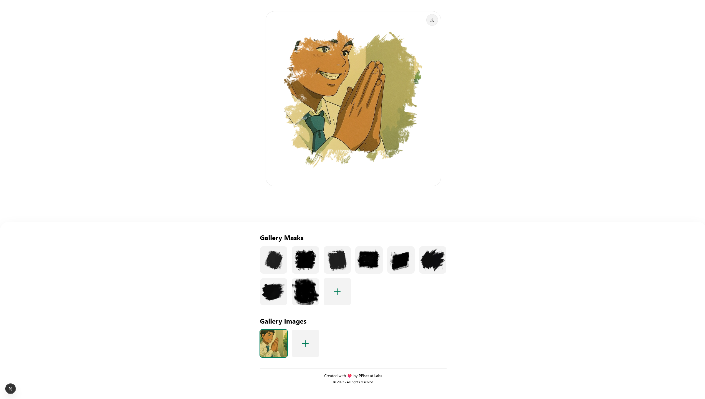

# Maskify - Image Masking Tool

Maskify is a web application that allows you to create and customize masks for your images. It provides a user-friendly interface and a variety of features to help you achieve the perfect mask for your photos.

## Features

- **Image Masking**: Upload and apply custom masks to your images
- **Mask Library**: Save and reuse masks for future editing sessions
- **Browser Storage**: Masks are saved in browser storage for easy access
- **File Management**: Upload, select, and manage your mask files
- **User-Friendly Interface**: Simple and intuitive controls for easy editing

## Getting Started

First, run the development server:

```bash
npm run dev
# or
yarn dev
# or
pnpm dev
# or
bun dev
```

Open [http://localhost:3000](http://localhost:3000) with your browser to see the application.

## How to Use

1. **Upload a Mask**: Click the upload button to select a mask image file
2. **Select a Mask**: Choose from your previously uploaded masks in the library
3. **Edit Your Image**: Apply the selected mask to your image
4. **Save Your Work**: Your masks are automatically saved to browser storage

## Technical Details

- **File Size Limitations**: Masks larger than 5MB may be too large to save in browser storage but will be available for the current session
- **Supported File Types**: Standard image formats including PNG, JPEG, etc.
- **Data Storage**: Uses browser session storage to maintain your mask library

## Deployment

The application is deployed at [https://maskify.pphat.top](https://maskify.pphat.top)

## Contributors


